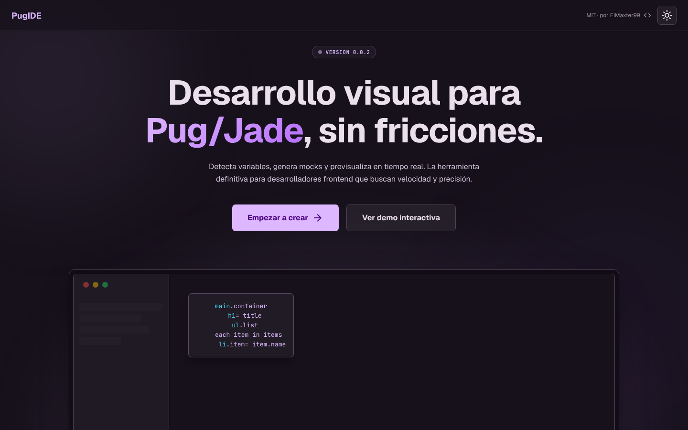
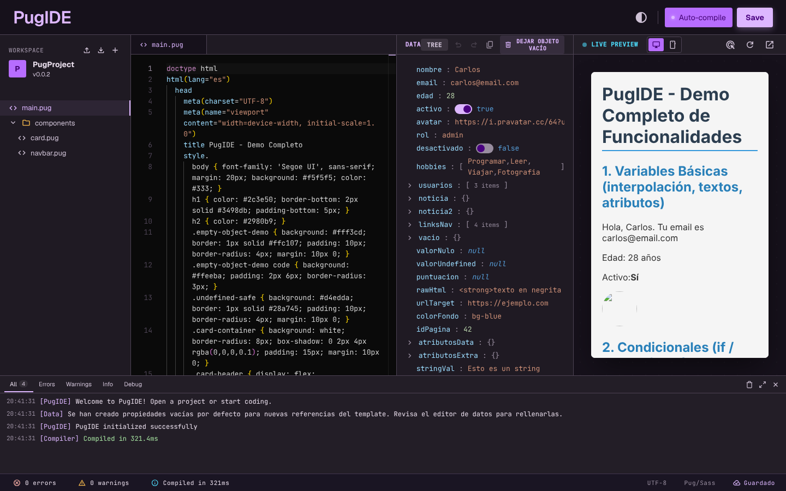

# PugIDE

Entorno de desarrollo visual para **Pug/Jade**: detecta variables, genera datos de prueba (mocks) y previsualiza el resultado en tiempo real, todo en el navegador.

 

## Capturas

### Vista principal



### IDE (`/ide?demo=true`)

Editor de código, árbol de datos y vista previa en vivo, con un proyecto demo cargado.



## Características

- Editor Pug con resaltado de sintaxis (Monaco) y soporte multi-archivo (includes / componentes).
- Detección automática de las variables usadas en la plantilla y editor de datos en árbol.
- Vista previa en vivo (escritorio / móvil) con auto-compilación.
- Consola con errores, warnings e info de compilación.
- Importar / exportar el proyecto.
- Modo demo: abre `/ide?demo=true` para cargar un proyecto de ejemplo completo.

- Estilos CSS, SCSS/Sass y Less compilados en el navegador; `<link>` locales y `@import`/`@use` entre archivos.
- Preview en modo PDF / página impresa (lee `@page { size }`, cuenta páginas, imprimir o guardar como PDF).
- Traducciones: las claves `t('CLAVE.ANIDADA')` generan automáticamente campos editables en los datos.
- Assets locales (imágenes y fuentes) que subes al proyecto y se guardan en tu navegador.

## Privacidad

**Nada sale de tu navegador.** No hay backend, ni cuenta, ni subida de código. El proyecto se guarda en el `localStorage` de tu navegador y los assets en IndexedDB. Si borras los datos del sitio, lo pierdes: exporta tus proyectos.

## Importar y exportar

- **Exportar**: a una carpeta de tu disco (File System Access API, p. ej. Chrome/Edge) o, si no está disponible, como `.zip`. Incluye los assets.
- **Importar**: desde una carpeta o un `.zip`; las rutas se conservan.
- Se importan archivos de texto (`.pug`, `.jade`, `.scss`, `.sass`, `.css`, `.json`, `.js`, `.html`, `.htm`, `.md`, `.txt`) e imágenes/fuentes como assets; el resto se ignora.

## Limitaciones conocidas

- `localStorage` tiene cuota (~5 MB): proyectos de texto muy grandes pueden no guardarse (se avisa).
- Importar/exportar a carpeta no funciona en Firefox/Safari (se usa `.zip`).
- El preview PDF emula la paginación; el resultado final puede variar según el navegador al imprimir.
- No hay sincronización entre dispositivos ni colaboración.

Más detalle técnico en [docs/ARCHITECTURE.md](docs/ARCHITECTURE.md); para colaborar, [CONTRIBUTING.md](CONTRIBUTING.md).

## Desarrollo

```bash
npm install
npm start          # http://localhost:4200
npm run build:prod # build de producción
npm run test:e2e   # pruebas e2e
```

Prueba la demo en local: <http://localhost:4200/ide?demo=true>

## Licencia

Distribuido bajo licencia [MIT](LICENSE). Es de uso **libre y gratuito**, pero debes **mantener el aviso de copyright y mencionar al autor original**:

> PugIDE © 2026 [ElMaxter99](https://github.com/ElMaxter99) — <https://github.com/ElMaxter99/pugIDE>
